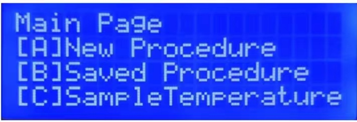

# Guidance for Automatic Salt Spraying System

## Introduction

This guidance is for automatic salt spraying system. The machine has a good user interface and more precise spray control, as well as a save function for the procedures to be used at any time following the same setups.

If not specified, **motor** refers to the stepper motor which provide rotational movements for the turntable and the specimens, and **servo** refers to the servo motor in order to press the nozzle button together with the cam.

If not specified, both the button [D]  and the button [*] can be used as return buttons, and the [#] button is used for confirmation.

## Calibration

The purpose of setting this function before booting up is that each time the nozzle is installed, it may cause an installation error, so that the servo will not be able to press the spray button if it is in the original position and moving in the same way.

The calibration interface will be shown as below, press [#] to calibrate, [*] to skip

When entering the calibration process, you will allow to adjust the position of the servo. The default position of the servo is 100. Press [A] or [B] to adjust the position in 1 degree intervals. The position range for the servo is 40°-180°.

The servo calibration is complete when the cam is just touching the spray button. Press [#] to confirm and the correction position value will be automatically saved. It is suggested that a calibration is carried out after each installation of the spray bottle.

## Main Menu

When the calibration is finished, main menu will show up. It consist of three functions:

A. New Procedure

B. Saved Procedure

C. Sample Temperature

Press the keypad buttons to access the corresponding function.

### New Procedure

Press [A] to set up a new procedure for salt spraying. The three parameters that can be set for the salt spraying are shown here.

A. Spray Time

B. Number of Sprays

C. Degree of Turn

Press the keypad buttons to set each parameters.

#### Spray Time

Press [A] to set spray time. There is no default value for the spray time, so if a valid time is not set, the program will not execute and an error will be prompted.

When setting the spray time, decimals can be set to a maximum of two decimal places. Press [*] to print a decimal point.

The spray time example shown below was set to 1.5 seconds.

When finished setting, press [#] to confirm and you will be back to "New Procedure" page after a while.

#### Number of Sprays

Press [B] to set the number of Sprays. The default value is 1, which means that if no value was input, the machine will spray the specimen for only once.

When finished setting, press [#] to confirm and you will be back to "New Procedure" page after a while.

#### Degree of Turn

Press [C] to set degree of turn. It is used to control the motor. The default value is 0, which means that if no value was input, the machine will not rotate the specimen in this procedure. The range of the degree of turn is 0°-360°.

The example shown the degree of turn below was 45°.

Press [#] to confirm. Then you will need to set the rotate direction. Just choose as required.

#### Look back at the parameters

In the "New Procedure" screen , press [A], [B] or [C] to view the parameters that have already been set and re-enter the values to overwrite them.

#### Run Procedure

In the "New Procedure" Screen, press [#] to run the procedure according to the parameters. The machine will first check the check the validity of the parameter and then move according to them. If one of the parameters is invalid, the machine will report an error and return to "New Procedure" screen.

When the execution is finished, press [#] to repeat the procedure and [D] to back to the Main Menu. 

#### Save Procedure

Press [B] to save the parameters. There are 3 saving target:

A. C-Ring

B. Fatigue

C. Bobbins

Select the location where you want to save and the machine will perform the save operation.

The saving target example below was [C]Bobbins.

When saving is finished, you will be back to Main Menu for a while.

### Saved Procedure

Press [B] to access "Save Procedure" page. This is the place where you can check and run the procedure saved before. Press the appropriate button to enter the corresponding procedure.

#### Run Saved Procedure

After choosing a saved procedure, if the values are valid, the machine will show the parameters first before it can be run. You can check whether the parameters are desired. If not, return to "New Procedure" to set up a new procedure.

Press [#] to run according to the parameters shown. When the movement is finished, press [#] to repeat and [D] to return to Main Menu.

#### Delete Saved Procedure

In "Saved Procedure" screen, press [D] and the title will be changed to "Delete Procedure". Select the procedure needed to be deleted and press [#] to confirm. The machine will delete the target procedure and will show "No Data Found" if you enter to the target procedure again.

The delete target example below was [C]Bobbins.

After a setting was cleared, you will be back to Main Menu after a while.

## Source Code

Source Code available at: https://github.com/Urutora96/Automatic-Salt-Spraying-System
